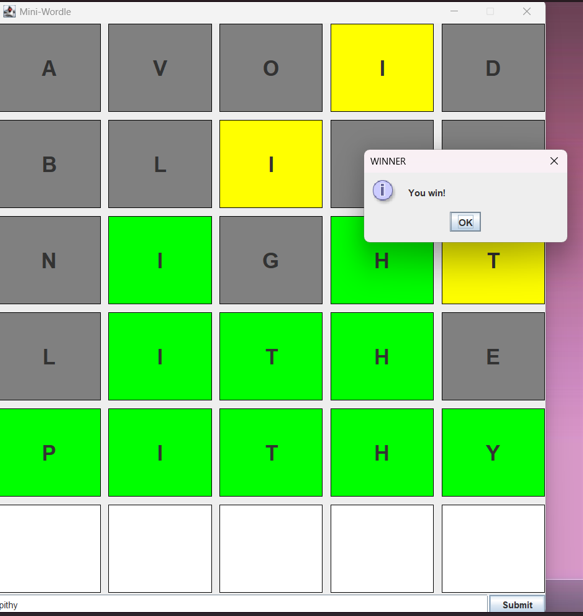

# Mini Wordle Game (Java Swing)#

A simple wordle clone implemented in Java using swing for the GUI. Guess the 5-letter word within 6 tries, If the letter turns green it indicates that it's correctif it turns yellow that means it's correct but not in the correct posistion, if it's grey that means that the letter isn't correct.

## Features: Classic Wordle rules with 5-letter words

Graphical interface built with Java Swing

Keyboard input via JTextField

Letter coloring to indicate correctness (green, yellow, gray)

Handles repeated letters correctly

Random word selection from a text file (words.txt)

## ScreenShot image

## Requirements

Java 8 or higher

Swing library (comes with standard Java SE)

words.txt file containing a list of 5-letter words, one per line

## Installation 1-Clone this repository:

git clone https://github.com/ahmedsamehgoda1-ai/mini-wordle.git

2-Navigate to the project folder:

cd mini-wordle

3-Make sure words.txt is in the project root.

# Usage

1-Type a 5-letter word in the input box

2-Press Submit or Enter

3-Repeat until you guess the correct word or run out of tries

4-A dialog will appear if you win or lose

## Code Structure

Main.java – Launches the GUI

wordlegui.java – Handles game logic and Swing interface

words.txt – List of 5-letter words for random selection

## License

MIT License – free to use and modify

## Note this is my first ever project on github, I would be more than happy to receive advices on the project